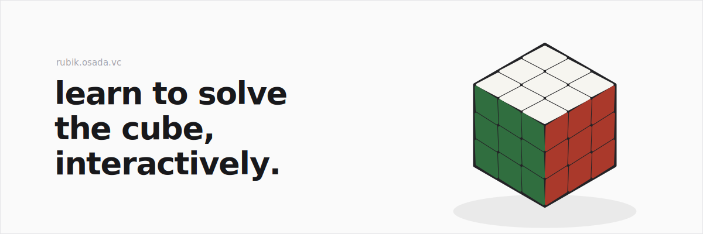

# rubik



learn to solve the rubik's cube with interactive guides, built around a 3d cube you can turn, scrub, and practice on right in the page.

## what's inside

- a beginner's method guide with step-by-step walkthroughs, cube snapshots, and practice panels
- a 3d cube rendered with three.js / react-three-fiber
- a small hand-rolled cube engine (`src/lib/cube`) handling state, notation, scrambles, and facelets - with tests

## stack

next.js, react, typescript, tailwind, react-three-fiber, zustand

## running it

```bash
bun install
bun dev
```

then open [localhost:3000](http://localhost:3000).

tests live next to the code:

```bash
bun test
```
